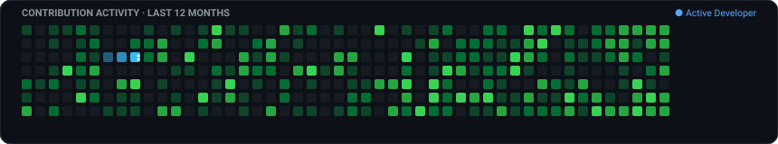

<!-- ====== HERO · Custom hand-authored animated SVG (RAG pipeline profile) ====== -->
<a href="https://github.com/jaganr02">
  
</a>

<!-- ====== SOCIAL LINKS ====== -->
<p align="center">
  <a href="https://www.linkedin.com/in/r-jagan-52bb94289/"></a>
  <a href="mailto:rajajagan697@gmail.com"></a>
  <a href="https://github.com/jaganr02"></a>
</p>

---

## About

B.Tech student in **Artificial Intelligence & Data Science**, focused on building **multi-agent architectures, retrieval-augmented generation (RAG), and production ML systems** that actually ship — grounded answers, deterministic pipelines, low latency, and real utility.

Most of my recent work centers around **Multi-Agent Orchestration (LangGraph)** and **Vector Search (Qdrant)**: coordinating autonomous agents across search, analysis, and critique loops while keeping responses fast and explainable.

```python
class Jagan:
    role     = "AI & Data Science Student (B.Tech)"
    focus    = ["Multi-Agent Systems", "LangGraph", "RAG & Vector Search", "FastAPI Backends"]
    building = "Autonomous intelligence engines & explainable ML systems"
    stack    = ["Python", "FastAPI", "LangGraph", "RAG", "MCP", "Qdrant", "Docker", "Scikit-Learn"]
    motto    = "Learn relentlessly. Build fearlessly. Ship something that matters."
```

Reach me directly at **[rajajagan697@gmail.com](mailto:rajajagan697@gmail.com)**.

---

## Featured Projects

* **[MarketPulse AI](https://github.com/jaganr02/MarketPulse-AI-Market-Research-Assistant)** — Autonomous multi-agent market intelligence platform powered by **LangGraph**, **FastAPI**, **Qdrant Vector DB**, Google Gemini, and real-time SSE streaming.
* **[AI Resume Analyzer](https://github.com/jaganr02/AI-Resume-Analyzer)** — Intelligent ATS evaluator and semantic skill-gap diagnostic engine built with **React**, **FastAPI**, **Groq LLaMA-3**, and **MongoDB**.
* **[AI Loan Risk Prediction](https://github.com/jaganr02/AI-Powered-Loan-Risk-Prediction-System)** — Supervised credit risk classifier (Random Forest, Logistic Regression) with a transparent rule-based explainability layer.
* **[Auto Ticket Categorizer](https://github.com/jaganr02/auto-ticket-categorizer)** — Real-time NLP support ticket classifier with confidence-score thresholds and fallback human triage.
* **[GoDocuMind](https://github.com/jaganr02/Godocumind)** — High-throughput document analytics and text insight service built natively in **Go (Golang)**.

---

## Tech Stack

<p>
  
  
  
  
  
  
  
  
  
  
  
</p>

---

## Activity

<p align="center">
  
</p>

---

## Contact

- **LinkedIn**: [linkedin.com/in/r-jagan-52bb94289](https://www.linkedin.com/in/r-jagan-52bb94289/)
- **GitHub**: [github.com/jaganr02](https://github.com/jaganr02)
- **Email**: [rajajagan697@gmail.com](mailto:rajajagan697@gmail.com)
